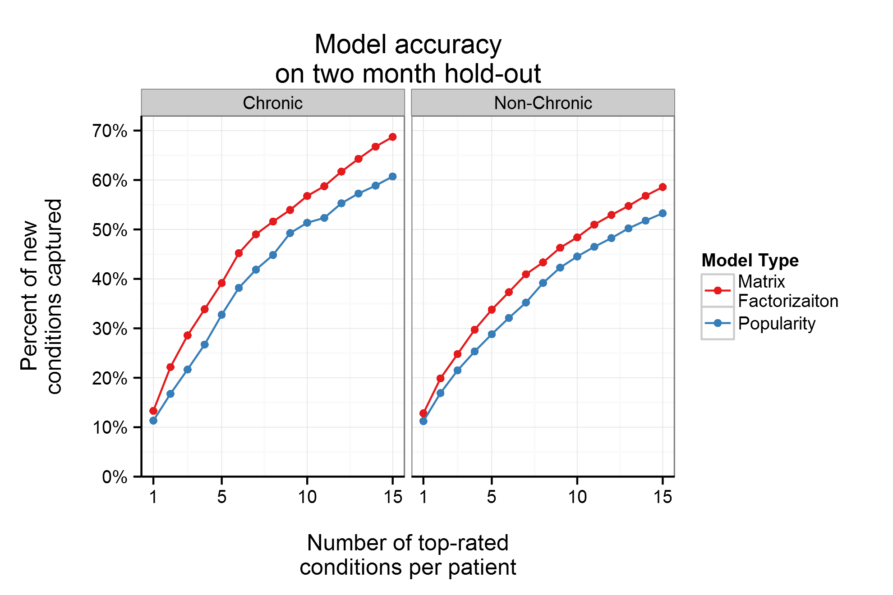
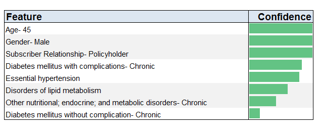
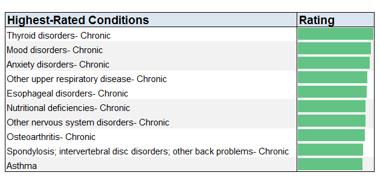
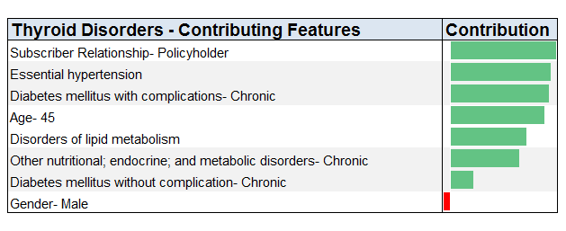

# Milliman PRM Analytics

----------

## Recommending uncoded conditions

Recent trends in healthcare legislation have led to a rise in risk-bearing healthcare provider organizations, such as Accountable Care Organizations. Entrusted with the care of thousands of patients, these organizations must leverage data-driven approaches to population health management in order to improve quality of care and reduce costs.

One area of concern for data-driven analysis involves the accuracy of a patient's clinical documentation. Efforts to improve accuracy in a population's clinical records are often referred to as clinical documentation improvement or coding improvement. From a clinical standpoint, the benefit from coding improvement is obvious. A patient record that contains the entirety of the patient's illnesses will result in a more appropriate treatment plan.

However, there are also financial incentives in coding improvement. Alternative payment models often account for the health status of a patient population, through the use of risk scores, when reimbursing a healthcare provider for services. A more accurate clinical record ensures that a risk-bearing healthcare provider is appropriately compensated when they care for a sicker population.

Coding improvement initiatives often start by looking through a given patient's records for explicit evidence of conditions that did not make it into the official diagnosis information: conditions coded on claims in prior years, or mentioned in the unstructured text of an electronic medical record.  After these explicit sources of coding improvement are exhausted, more advanced methods can try to suggest conditions that have never appeared on a patient's medical history. One approach can be to find explicit evidence of missed codings in large reference datasets and train predictive models that can be then be applied to other, potentially slimmer sources. This can work well for predicting specific chronic conditions in a population, even when only a short claims history is available.

At Milliman PRM Analytics, we have taken a different approach to identifying uncoded conditions through the use of a recommender system. Our recommender system seeks to identify common clinical patterns among patients in a population; we then make patient level condition recommendations based upon comorbities experienced by similar patients.  The recommender approach works well at giving personalized recommendations from the patient perspective.

## What is a recommender system?

If you have ever viewed a product on Amazon or watched a show on Netflix, then you have been a part of a recommender system. Recommender systems are commonly used to help users identify potentially interesting products among a large list of options, through the use of historical viewing or rating information. For example, Netflix will recommend certain shows to you based on your previous viewings. These recommendations are built using viewing or rating data from other users who have viewed the same shows as you.

A common model training process for recommender systems is collaborative filtering, which uses historical rating data to find similarities between users or items. Collaborative filtering often takes three forms: user-based, item-based, or matrix factorization. User-based collaborative filtering seeks to find users that have rated items similarly, and predict other items that similar users liked. Item-based collaborative filtering seeks to find similarities between items themselves, and then recommend items that are similar to a user's highly rated items. Matrix factorization estimates latent factors for each user and item and then uses these latent factors to find items that hopefully align with a user's preferences.

For an illustration of collaborative filtering, consider the example patient panel below.

|Condition|Patient 1|Patient 2|Patient 3|Patient 4|
|---|---|---|---|---|
|Diabetes|X|X|||
|Hypertension|X|X|||
|Asthma|||X||
|COPD||X|X|X|
|Back Pain|||X|X|

Patient 1 appears to be most similar to Patient 2. Thus, for Patient 1, we would predict that COPD is the most likely uncoded condition. Likewise, Patient 4 is most similar to Patient 3, so we would assume that asthma is the most likely uncoded condition for Patient 4.

|Condition|Patient 1|Patient 2|Patient 3|Patient 4|
|---|---|---|---|---|
|Diabetes|X|X|||
|Hypertension|X|X|||
|Asthma|||X|O|
|COPD|O|X|X|X|
|Back Pain|||X|X|

The preference inputs in recommender systems may take two forms: explicit ratings or implicit ratings. Explicit ratings are generated when the users themselves identify their preference, such as giving a rating to a movie or a product. While explicit ratings carry a higher level of confidence for a user's preference, they are often not available. More commonly, implicit ratings are inferred from a user's actions, such as viewing a movie or buying a product.

Our implementation utilizes an implicit rating, matrix-factorization model to predict uncoded conditions. Each patient is a "user", with conditions being recommended as the "items". Implicit condition confidence values, or ratings, are inferred from the medical history of each patient in a population. These user, condition, and confidence inputs are processed to generate latent factors for each patient and condition. These latent factors, an abstract representation of similarities between users and conditions, can be combined to generate a predicted rating for each patient-condition pairing.

The example below illustrates using the estimated latent factors to generate recommendations for a single patient.

|Latent Factor|Patient|Diabetes|Hypertension|Asthma|Menopause|
|:---|---:|---:|---:|---:|---:|
|1|0.8|0.2|0.3|0.1|-1.0|
|2|0.4|0.6|0.8|0.1|0.1|
|3|-0.5|0.1|-0.1|-0.1|0.1|
|4|0.6|-0.2|0.2|0.5|-0.1|
|**Patient Rating**|**---**|**0.23**|**0.73**|**0.47**|**-0.87**|

A condition's rating for a given patient is calculated as the dot product of the patient's latent factors and the respective condition's latent factors (e.g. Diabetes Rating = 0.8x0.2 + 0.4x0.6 + -0.5x0.1 + 0.6x-0.2). Here, we would recommend hypertension as the most likely uncoded condition. While latent factors are not easily interpretable, we could roughly associate each latent factor with a patient characteristic. Latent factor 1 is likely gender-related, due to the high coefficient for menopause. Latent factor 2 may be related to blood pressure, considering the high coefficients of both diabetes and hypertension, while latent factor 4 may be related to lung issues.  Most real matrix factorization models use so many latent factors it would not be reasonable to try and actually attach interpretations to them.

A matrix factorization approach provides some useful benefits. The model is fast and simple to train, and thus can realistically be tuned to find unique relationships for each patient population. We utilized an implementation in Apache Spark, a clustered computing framework, to gain additional speed by distributing the calculations. Matrix factorization works well with the sparse nature of patient condition information (e.g. most patients only have a handful of conditions). Finally, the comorbid nature of many conditions can be naturally expressed via latent factors (e.g. a latent factor related to cardiovascular disease can usefully explain many conditions).

## Feature Engineering

There are two important considerations for generating useful input data: which features will be used, and how will confidence values for these features be determined. Our features are a combination of historical condition information and demographic information. These features and their confidence values are generated from a patient population's clinical history.

For condition features, diagnoses in a patient's clinical history are grouped into clinically meaningful categories, or conditions, using the Agency for Healthcare Research and Quality's (AHRQ's) Clinical Classifications Software (CCS). Patients who are seen for the same condition multiple times are given a higher confidence value. More confidence is given for conditions that have been coded more recently. Additionally, more confidence is given for conditions that were coded in an inpatient setting, rather than an outpatient setting.

The two main demographic features are age and gender. Unlike condition features, demographic features are given the same confidence level across all patients. The confidence value is determined such that demographic importance does not overpower condition information. However, these confidence values must also be large enough that gender-specific and age-specific conditions are modeled appropriately.

## Fitting the Model

The two most important hyper-parameters are lambda, the regularization parameter, and rank, the number of latent factors. Lambda should be strong enough to avoid overfitting in the training data, while also still allowing for meaningful personalization in predictions. Rank must be high enough to allow for meaningful groupings in latent factors, while avoiding the computational burden of higher rank models.

We want to determine the hyper-parameter values that are most useful for predicting uncoded conditions. To accomplish this, we create a tuning dataset which excludes the most recent months of data. The hold-out data is analyzed to find conditions coded for the first time in a patient's medical history. We trained a variety of models on the tuning dataset with different hyper-parameter values.  For each model, we use the hold-out data to calculate the percentage of newly coded conditions predicted in each patient's top ten recommendations. Using the best performing hyper-parameter values, we then train a final model with all of the available data to make our recommendations.

This whole tuning process is fast enough to find optimal hyper-parameters for each unique patient population.

## Model Performance

When using any advanced analytics, it is always important to have a useful baseline model to compare against.  For a recommender model, the most basic reference model would be a simple *popularity* model that recommends the population's most common conditions, excluding conditions that have already been coded for a patient. For example, a popularity model would recommend the most common condition, such as hypertension, as the first recommendation for all patients that do not already have hypertension coded.

The illustration below compares prediction accuracy on a sample population for our recommender model ("Matrix Factorization") versus the simpler "Popularity" model. The vertical axis shows the estimate of accuracy discussed above: the percentage of newly coded conditions from the hold-out set that were in the top N recommendations for each patient.  The horizontal axis displays the results for different numbers of recommendations for each patient.

The left side focuses on chronic conditions, which are more likely to go uncoded if they are not the primary reason that a patient seeks care.  The right side focuses on non-chronic conditions. Because of the higher intensity level required in care, non-chronic conditions are more likely to be coded at the time the illnesses arise.  For both the chronic and non-chronic conditions, the matrix factorization model consistently outperforms the popularity model.

## Case Study

Below we will examine model inputs and model results for a sample patient with diabetes. For this patient, we will examine the input features, the top ten recommendations, and a breakdown of the contribution to the top prediction.

### Diabetes Patient

The table below shows the input features and their respective confidence values. Demographic features are given a constant confidence value, whereas the confidence values for condition features are a factor of the patient medical history.

The table below shows the top ten recommendations and their relative rating for this patient. The ratings are determined through a recombination of latent factors for the patient and the respective condition.

The table below breaks down the relative contribution for the top recommended condition, thyroid disorders. A recommendation's rating can be decomposed into contributions from each of the input features, based on the feature's confidence value and latent factors.

The demographic features have a high contribution to the recommendation, partially due to the high confidence value associated with these features. Hypertension and diabetes are other strong contributing factors. Male gender appears to be slightly negatively associated with thyroid disorders.

## Conclusion

These recommendations can be used in a number of work flows. On the data side, the recommendations provide a more narrow, manageable focus for investigating medical records. A systematic review of a medical record may uncover evidence of the condition in a previous encounter, which would signal that the condition should be coded in a more appropriate channel. On the provider side, these recommendations may also be used to create a more manageable focus. With a busy schedule and a limited amount of time spent with each patient, it's not possible to rule out every single illness. However, with a short list of potential comorbidities, a patient's primary care provider can investigate a few key areas for any signs of illness.

Accurately documenting a patient's clinical status will be increasingly important as more healthcare providers enter into alternative payment arrangements. Provider organizations face a growing scrutiny on the quality and cost of care. As a result, advanced analytics must find their way into daily workflows. Our recommender system provides a unique perspective towards coding improvement that produces useful recommendations of uncoded conditions. Coding improvement initiatives can lead to better clinical outcomes as well as increased revenue in the case of risk-based arrangements.

