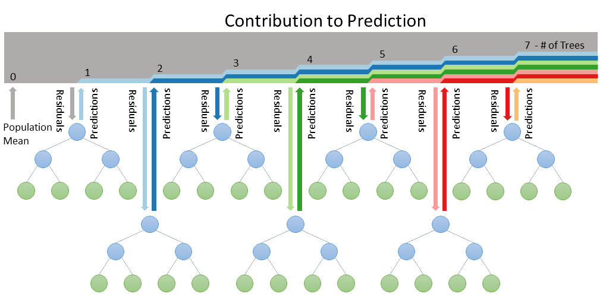
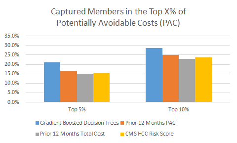

##Predicting future medical expenses through machine learning

The payment landscape of healthcare is changing from fee-for-service to fee-for-performance and alternative revenue arrangements.  As payers and governments move to alternative revenue arrangements, health care providers will be asked to participate in risk sharing arrangements.  The result is that both healthcare payers and providers have an increased need for effective healthcare population management tools/products. Entities that are responsible for managing an attributed population need to know the best way to prioritize patients for care management.  Most current products in the market focus on ordering patients for care management by highest cost or highest risk.  Such approaches may ignore some critical business goals:

 * Identify risks that can be mitigated through care management
 * Develop advanced metrics for measuring performance and quality
 * Optimize and quantify potential cost saving from care management programs

Providers will need to analyze the potential risks for each attributed member as outcome risks are transferred to them through new reimbursement models.  Conventional analytic tools do not necessarily provide insight into this risk and new approaches are necessary for that. 

###The average member vs. the individual outlier

Conventional prospective risk adjusters predict the relative future cost of an average member with given medical attributes. These scores are designed to provide insight into a population's health and expenses but can perform poorly on predicting an individual's expense. In contrast, machine learning models can be constructed to predict the distribution of an individual's total and potentially avoidable healthcare expenses.[^1] The distribution of potential healthcare expenses provides insight into provider risk per member. In other words, how high could healthcare expenses be for an individual under an adverse risk outcome scenario? If healthcare expenses are adverse, how much could be reduced through changes to ambulatory care management?  This focus on individual member risk, rather than overall average population outcomes, gives the health care provider valuable information in selecting who and what to manage.

###Boosting the individual signal to drown out the noise

Variations of Friedman's gradient boosting machine were developed for these predictions.[^2]  A gradient boosting machine is a framework for creating boosted decision trees, which produce different types of predictions depending on the use of various loss functions (e.g., probabilities, quantiles, or averages). Each decision tree is a simple, interpretable model. A series of true/false decision points leads to predictions for each terminal leaf in the tree. 

A single decision tree is not competitive with other models on prediction accuracy; decision trees generally need to be blended to improve the level of accuracy. Boosting is a method of sequentially building small decision trees to slowly generate a more robust and accurate prediction. Figure 1 illustrates how predictions are grown from decision trees. 

While boosting can often result in dramatic improvements in accuracy, it is at the loss of interpretability and an increased risk of over-fitting.[^3] A version of the random subspace method was custom written for these analytics to reduce the models' over-fitting tendencies and improve the computational efficiency.[^4] Random subspacing forces the model to learn from a broader amount of the information, creating trees with more statistical independence. This results in a more robust prediction. 

In contrast to other prediction algorithms, gradient boosted decision trees:

 - Are more robust against the influence of outlier data
 - Reduce the influence of weak or highly collinear variables
 - Handle missing values without complex imputations or deletions
 - Are designed to model nonlinear relationships and interactions
 - Employ multiple regularization techniques to reduce over-fitting 

The ability of boosted decision trees to produce quality predictions relies on selecting an optimal number of trees. Optimizing the number of trees is done by *k*-fold cross-validation (*k*-fold CV), which involves randomly dividing the set of observations into *k* groups, or *folds*, of approximately equal size. The first fold is treated as a validation set, and a model is built on the remaining *k* − 1 folds. The appropriate error metric is then optimized on the validation set. This procedure is repeated *k* times; each time, a different group of observations is treated as a validation set. This process results in *k* estimates of the test error. The *k*-fold CV error is computed by averaging the testing error from each fold.[^5] The optimal number of trees is then selected based on the lowest *k*-fold CV error. To improve consistency of the results the entire *k*-fold cross-validation process is repeated multiple times and the final predictions averaged. While it is computationally expensive to run all the repeated *k*-folds individually, they are independent models that can be calculated simultaneously with a large computer cluster.

###Garbage in, garbage out

The "garbage in, garbage out" adage in this case refers to the need for quality variables to make quality predictions. For example, claim line detail is too granular to make a good model. Deriving variables from the claims data will condense the information into useful chunks. Summarizing an individual's utilization and costs by month or quarter generally produces better results. The claims and eligibility data is broken down and summarized into the following categories:

1. Demographic: Information about an individual includes:

    * Gender
    * Age
    * Eligibility status
2. Medical conditions: Centers for Medicare and Medicaid Services (CMS) Hierarchical Condition Categories (HCC).

3. Risk Scores: Varies by line of business.

4. Historical cost and utilization by:

    * Potentially avoidable services
    * In-network versus out-of-network services
    * Type of service (e.g., inpatient, ER, and skilled nursing facility)
    * Date of service

5. Electronic medical record data

    * Vitals (e.g., height, weight, and blood pressure)
    * Lab results
    * Smoking statuses

###Performance

Predictions of the potentially avoidable expenses provide healthcare entities with valuable information when selecting individuals to manage. Historical data is used to make predictions for a known time period. The members during the prediction period are ranked based on their actual potentially avoidable costs and then compared to the predicted ranks. The predictions from the gradient boosting machine are compared to rankings produced from the CMS HCC community risk scores and rankings based on the prior 12 months of total and potentially avoidable costs. Figure 2 illustrates the ranking accuracy with the percentage of members in the actual top X% that were also identified in the top X% of the prediction method.

###Conclusion

The advantages of gradient boosted decision trees over traditional predictive modeling techniques help produce more accurate projections of future expenses. The accuracy can be seen in the improved ranking of members with high potentially avoidable costs. This allows the care coordination teams to strategically target members to manage, saving time and resources—and, hopefully, reaching members before they incur potentially avoidable costs. In aggregate, the algorithm’s predictions could also form a basis for benchmarking care management outcomes.

[^1]: Stranges, E., Stocks, C. Potentially Preventable Hospitalizations for Acute and Chronic Conditions, 2008. 
[HCUP Statistical Brief #99](http://www.hcup-us.ahrq.gov/reports/statbriefs/sb99.pdf). November 2010. Agency for Healthcare Research and Quality.

[^2]: Friedman, J. H. (2001). [Greedy Function Approximation: A Gradient Boosting Machine](http://projecteuclid.org/download/pdf_1/euclid.aos/1013203451). Annals of Statistics 29(5):1189-1232.

[^3]: James, G., et al. An Introduction to Statistical Learning: With Applications in R. Springer Texts in Statistics 103, p. 303 DOI [10.1007/978-1-4614-7138-7](http://dx.doi.org/10.1007%2F978-1-4614-7138-7).

[^4]: Ho, Tin (1998). The Random Subspace Method for Constructing Decision Forests. IEEE Transactions on Pattern Analysis and Machine Intelligence 20 (8): 832–844. doi:[10.1109/34.709601.](http://dx.doi.org/10.1109%2F34.709601)

[^5]: James, G. ibid., p. 181.